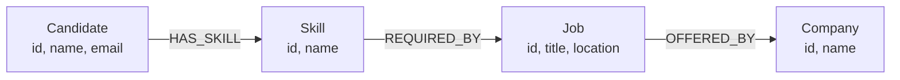

# Wexa Job Graph

A graph-powered job recommendation application built for the **Wexa AI CognoDB Take-Home Assignment**.

The application uses **CognoDB** as the graph database and the official **Neo4j JavaScript Driver** to model relationships between candidates, skills, jobs, and companies.

## 🚀 Live Demo

**Hosted Application:**
https://wexa-job.vercel.app/#jobs

---

## 📌 Overview

**Wexa Job Graph** is a web application that allows users to explore job opportunities and discover jobs based on candidate skills.

The application models relationships between:

* Candidates
* Skills
* Jobs
* Companies

The core graph is:

```text
Candidate
    |
    | HAS_SKILL
    ↓
  Skill
    |
    | REQUIRED_BY
    ↓
   Job
    |
    | OFFERED_BY
    ↓
 Company
```

This graph structure allows the application to perform multi-hop traversals and identify jobs that are connected to the skills of a candidate.

---

## ✨ Main Features

* Explore available jobs
* View candidate information
* View companies associated with jobs
* Get job recommendations based on candidate skills
* Display matching skills
* Perform multi-hop graph traversal
* Execute parameterized Cypher queries
* Use the official Neo4j JavaScript Driver
* Handle database/API failures gracefully
* Responsive and user-friendly interface
* Hosted web application

---

# 🧠 Why a Graph Database?

The main reason for choosing a graph database is that the core problem is based on **relationships between entities**.

For example, finding suitable jobs for a candidate requires following relationships such as:

```text
Candidate → Skill → Job → Company
```

With a relational database, the same problem could require multiple tables and joins:

```text
Candidates
     ↓
CandidateSkills
     ↓
Skills
     ↓
JobSkills
     ↓
Jobs
     ↓
Companies
```

As relationship-based questions become more complex, the graph model provides a natural way to represent and traverse those connections.

For example:

> Find jobs that match a candidate's skills and return the companies offering those jobs.

This can be represented naturally as a multi-hop graph traversal:

```text
Candidate
    ↓
HAS_SKILL
    ↓
Skill
    ↓
REQUIRED_BY
    ↓
Job
    ↓
OFFERED_BY
    ↓
Company
```

This is the main reason a graph database is a good fit for this application.

---

# 🗺️ Graph Data Model



## Nodes

| Node        | Description                                       |
| ----------- | ------------------------------------------------- |
| `Candidate` | Represents a person looking for job opportunities |
| `Skill`     | Represents a technical or professional skill      |
| `Job`       | Represents an available job opportunity           |
| `Company`   | Represents the company offering a job             |

## Relationships

| Relationship  | Description                                  |
| ------------- | -------------------------------------------- |
| `HAS_SKILL`   | Connects a candidate to a skill they possess |
| `REQUIRED_BY` | Connects a skill to a job that requires it   |
| `OFFERED_BY`  | Connects a job to the company offering it    |

---

# 🏗️ Application Architecture

```text
┌─────────────────────────────┐
│       React Frontend        │
│            Vite             │
└──────────────┬──────────────┘
               │
             Axios
               │
               ▼
┌─────────────────────────────┐
│       Express Backend       │
│          Node.js            │
└──────────────┬──────────────┘
               │
      Neo4j JavaScript Driver
               │
               ▼
┌─────────────────────────────┐
│           CognoDB           │
│       Graph Database        │
└─────────────────────────────┘
```

### Request Flow

```text
User
 ↓
React UI
 ↓
Axios API Request
 ↓
Express Route
 ↓
Graph Query
 ↓
Neo4j JavaScript Driver
 ↓
CognoDB
 ↓
Cypher Result
 ↓
Express API
 ↓
React UI
```

The frontend does not directly connect to CognoDB. The backend handles database communication so that database credentials remain private.

---

# 🛠️ Technology Stack

## Frontend

* React
* Vite
* JavaScript
* Axios
* CSS

## Backend

* Node.js
* Express.js
* CORS
* dotenv
* Neo4j JavaScript Driver

## Database

* CognoDB
* openCypher
* Bolt protocol

## Development

* Git
* GitHub
* Visual Studio Code

---

# 📁 Project Structure

```text
wexa-job-graph/
│
├── client/
│   ├── public/
│   ├── src/
│   │   ├── assets/
│   │   ├── App.jsx
│   │   ├── App.css
│   │   ├── index.css
│   │   └── main.jsx
│   ├── package.json
│   └── vite.config.js
│
├── server/
│   ├── config/
│   │   └── db.js
│   │
│   ├── queries/
│   │   ├── graphQueries.js
│   │   └── queries.cypher
│   │
│   ├── routes/
│   │   ├── candidates.js
│   │   └── jobs.js
│   │
│   ├── seed/
│   │   └── seed.js
│   │
│   ├── server.js
│   ├── test-db.js
│   └── package.json
│
├── screenshots/
│   ├── jobs.png
│   ├── recommendations.png
│   └── candidate.png
│
├── .gitignore
└── README.md
```

> **Important:** `.env` should not be committed to GitHub. It contains database credentials and should be excluded using `.gitignore`.

---

# 🔐 Environment Variables

The CognoDB connection details are stored using environment variables.

Create a `.env` file inside the `server` directory for local development:

```env
COGNODB_URI=bolt+s://<instance-id>.databases.cognodb.cloud
COGNODB_USERNAME=cognodb
COGNODB_PASSWORD=<your-cognodb-password>
```

Never commit the `.env` file or database password to the repository.

The `.gitignore` file should include:

```text
.env
node_modules
dist
```

---

# ☁️ CognoDB Setup

To run the application locally:

1. Create a CognoDB account.
2. Create a free `c0` instance.
3. Select a region.
4. Copy the generated database password.
5. Copy the Bolt connection URI.
6. Add the credentials to `server/.env`.
7. Install the dependencies.
8. Test the database connection.
9. Run the seed script.
10. Start the backend and frontend.

CognoDB uses openCypher over the Bolt protocol and can be accessed using the official Neo4j JavaScript Driver.

---

# ▶️ Local Setup

## 1. Clone the Repository

```bash
git clone <YOUR_GITHUB_REPOSITORY_URL>
cd wexa-job-graph
```

---

## 2. Install Frontend Dependencies

```bash
cd client
npm install
```

---

## 3. Install Backend Dependencies

Open another terminal:

```bash
cd server
npm install
```

---

## 4. Configure Environment Variables

Inside the `server` directory, create:

```text
.env
```

Add:

```env
COGNODB_URI=bolt+s://<instance-id>.databases.cognodb.cloud
COGNODB_USERNAME=cognodb
COGNODB_PASSWORD=<your-password>
```

---

## 5. Test the Database Connection

From the `server` directory:

```bash
node test-db.js
```

This verifies that the application can connect to CognoDB.

---

## 6. Seed the Database

From the `server` directory:

```bash
node seed/seed.js
```

The seed script creates the sample graph data, including candidates, skills, jobs, companies, and their relationships.

---

## 7. Start the Backend

```bash
cd server
node server.js
```

---

## 8. Start the Frontend

In another terminal:

```bash
cd client
npm run dev
```

Open the local URL provided by Vite.

---

# 🔍 Main Graph Queries

The application uses Cypher queries through the official Neo4j JavaScript Driver.

## 1. Multi-Hop Job Recommendation

A key graph traversal follows:

```text
Candidate → Skill → Job → Company
```

Example:

```cypher
MATCH (c:Candidate {id: $candidateId})-[:HAS_SKILL]->(s:Skill)
      -[:REQUIRED_BY]->(j:Job)
      -[:OFFERED_BY]->(company:Company)
RETURN j, company, collect(s.name) AS matchingSkills
```

This query:

1. Finds the selected candidate.
2. Traverses to the candidate's skills.
3. Finds jobs requiring those skills.
4. Traverses from each job to the company offering it.
5. Returns the job, company, and matching skills.

The candidate ID is supplied as a parameter rather than concatenated into the Cypher query.

---

## 2. Candidate Skill Matching

Example:

```cypher
MATCH (c:Candidate {id: $candidateId})-[:HAS_SKILL]->(s:Skill)
MATCH (s)-[:REQUIRED_BY]->(j:Job)
RETURN j, collect(s.name) AS matchingSkills
```

This query finds jobs connected to skills possessed by a particular candidate.

---

## 3. Parameterized Queries

The application uses query parameters instead of string-concatenated Cypher.

Example:

```javascript
const result = await session.run(
  `
  MATCH (c:Candidate {id: $candidateId})-[:HAS_SKILL]->(s:Skill)
        -[:REQUIRED_BY]->(j:Job)
  RETURN j, collect(s.name) AS matchingSkills
  `,
  {
    candidateId
  }
);
```

Using parameters makes queries safer, reusable, and easier to maintain.

> **Note:** The exact query examples in this README should correspond to the queries implemented in `server/queries/graphQueries.js` and `server/queries/queries.cypher`.

---

# 🌱 Seed Data

The repository contains a database seed script:

```text
server/seed/seed.js
```

The script creates realistic sample data for:

* Candidates
* Skills
* Jobs
* Companies
* Candidate-to-skill relationships
* Skill-to-job relationships
* Job-to-company relationships

The dataset is intentionally small enough for the CognoDB free tier while still demonstrating meaningful graph relationships and multi-hop queries.

---

# ⚠️ Error Handling

The backend includes handling for database connection and query failures.

If CognoDB is unavailable, the application should return a controlled API error rather than exposing database credentials or crashing unexpectedly.

The frontend can then display an appropriate error state to the user.

This helps make the application more reliable in situations where the database is temporarily unavailable.

---

# 🎨 UI / UX

The application is designed so that a non-technical user can explore the job graph without needing to understand the underlying database.

The interface focuses on:

* Clear navigation
* Readable typography
* Job discovery
* Candidate-based recommendations
* Matching skill visibility
* Responsive layout
* Loading states
* Empty states
* Error handling
* Simple interaction flow

---

# 📸 Screenshots

Add screenshots of the final application to a `screenshots` directory.

Recommended screenshots:

### Job Explorer


### Job Recommendations


### Candidate View


> Replace the image filenames above if the actual screenshot filenames are different.

---

# 🚀 Deployment

The application frontend is deployed using Vercel.

### Live Application

**https://wexa-job.vercel.app/#jobs**

The deployed application provides the user-facing interface for exploring the job graph.

Database credentials should be configured through environment variables in the deployment environment and must never be exposed in frontend source code.

---

# 🧪 Testing

The application can be tested using the following flow:

1. Open the deployed application.
2. Navigate to the Jobs section.
3. Explore available jobs.
4. Select a candidate where supported.
5. View matching skills or recommendations.
6. Verify that the displayed results correspond to the graph relationships.
7. Test the application with an unavailable API/database to verify the error state.

---

# 🔒 Security

The project follows basic security practices:

* CognoDB credentials are stored in environment variables.
* `.env` is excluded from Git.
* Database credentials are not exposed to the React frontend.
* Cypher queries use parameters.
* No database passwords are hardcoded in the source code.

---

This project was created for the **Wexa AI Take-Home Assignment**.
